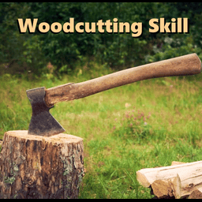

# Woodcutting Skill - Overhaul (B42)



An overhaul of the Project Zomboid Woodcutting skill, updated for Build 42.

This version is fully configurable: damage per level, optional one-hit threshold,
maximum damage cap, extra-loot rework, XP multiplier, and a complete Sandbox page
for singleplayer, hosted multiplayer, and dedicated servers.

The Build 42 version uses B42-safe Timed Action patching for Chop Tree and Remove
Bush. It is server-authoritative for multiplayer consistency and does not override
vanilla files directly.

## Links

- Steam Workshop: https://steamcommunity.com/sharedfiles/filedetails/?id=3559783131
- Build 41 version: https://steamcommunity.com/sharedfiles/filedetails/?id=3559242180
- Original Woodcutting Skill by Champy: https://steamcommunity.com/sharedfiles/filedetails/?id=2944004910

## What's New In B42

- Safe Timed Action patch for Chop Tree and Remove Bush.
- No vanilla file overrides, making it friendlier to Build 42 changes.
- Server-authoritative logic for consistent multiplayer results.
- Updated translations using Build 42 table format: `IG_UI`, `UI`, and `Sandbox`.
- Dedicated Sandbox page with clear tooltips for every option.

## Highlights

- Per-level tree damage with an optional one-hit threshold.
- Endurance savings per level and faster bush removal.
- `+2` TreeDamage per level with axes, keeping the spirit of the original mod.
- Extra loot rework on medium and large trees:
  - Logs
  - Tree branches
  - Twigs
  - Pinecones
  - Rare fruit and other finds, gated by skill and season
- XP multiplier for tree hits.
- Woodcutter trait with `+1` Woodcutting.
- Profession and trait boosts for related characters.

## Installation

### Steam Workshop

Subscribe on Steam Workshop and enable the mod in Project Zomboid.

Workshop ID:

```txt
3559783131
```

Mod ID:

```txt
WoodcuttingSkill_B42
```

### Manual / Local Testing

The mod folder lives at:

```txt
Contents/mods/WoodcuttingSkill - Build 42/42
```

For local testing outside the Workshop uploader, copy or link the mod folder into
your Project Zomboid mods directory.

## Configuration

### Singleplayer / Hosted Multiplayer

When creating a world, open:

```txt
Sandbox Options > Woodcutting
```

Adjust the Woodcutting options there before starting the world.

### Dedicated Server

Edit the save's Sandbox settings or create a Sandbox preset and configure:

```lua
SandboxVars = SandboxVars or {}

SandboxVars.Woodcutting = {
    damageBaseMultiplier = 1.0,
    damagePerLevel = 0.15,
    damageMaxMultiplier = 8.0,
    oneHitLevelThreshold = 6,
    oneHitTreeDamage = 2000,
    onlyForAxes = true,
    xpMultiplier = 1.0,

    cumulatedForagingAndWoodcuttingSkillLevelForFruit = 8,
    FruitTreeExtra = 80,
    Winter = 130,
    Pinecone = 20,
    PineTreeExtra = 120,
    Log = 40,
    TreeBranch = 35,
    Twigs = 30,
}
```

With the defaults, around level `6-7` you can one-hit trees if the threshold is
enabled.

## Server IDs

```txt
Workshop ID: 3559783131
Mod ID: WoodcuttingSkill_B42
```

## Compatibility

- Made for Project Zomboid Build 42.
- For Build 41, use the separate Build 41 version linked above.
- High compatibility through patching instead of direct vanilla overrides.
- Only conflicts with mods that replace Build 42's `ISChopTreeAction` or
  `ISRemoveBush`.
- Extra-loot chances respect the Sandbox `Nature Abundance` setting.

## Languages

Currently supported:

- English
- Portuguese (Brazil)

If you see raw keys such as `IGUI_perks_Woodcutting`, switch the game language to
English or Portuguese (Brazil), then restart the game or update the mod.

Translation contributions are welcome.

## Credits

- Original concept and baseline implementation: Champy
- Build 42 overhaul and maintenance: WindLother

## Repository Layout

```txt
Contents/
  mods/
    WoodcuttingSkill - Build 42/
      42/
        media/
        mod.info
        poster.png
        steamdesc.txt
preview.png
workshop.txt
```

